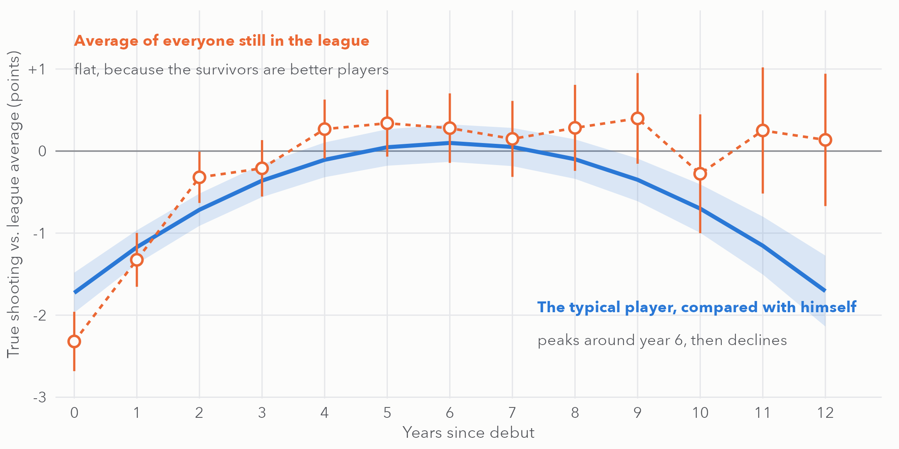

# NBA shooting career curves

How does a player's shooting develop over a career, once you separate real skill from luck?
This project models every NBA player-season from 2002 to 2026 as a noisy view of three hidden parts:
**permanent talent**, **short-term form**, and **sampling luck**. It uses a Bayesian state-space model
in Stan and scores every model against simple rules on seasons it never saw.



*The typical player, compared with himself, peaks around year 6 and then declines (blue). The simple average
of everyone still in the league stays flat (orange), because weaker shooters leave.*

## Findings

| | |
|---|---|
| Variation in a season's TS% that is permanent talent | **39%** (form 27%, sampling luck 33%) |
| Time for half of a hot or cold stretch to fade | **1.9 seasons** |
| Forecast error on 2023–2026, state space vs. best simple rule | **3.36 vs. 4.19** TS% points (20% lower) |
| Share of outcomes inside the 90% forecast intervals | **88.5%** |

Things that did **not** add value, reported as such:
- A player's style last season (from a PCA of box-score rates) did not improve the forecast (3.37 vs. 3.36).
- Career minutes played were no better than years since debut as a development clock.
- Strong and weak teams sit in different parts of style space. That gap is tangled with roster spread
  and team quality, so it supports no causal claim.

The two-page summary is [`writeup/two_pager.html`](writeup/two_pager.html). It is a single self-contained
file: download it and open it in a browser. The reasoning, decision rules and known risks are in
[`docs/PLAN.md`](docs/PLAN.md), with one notes file per stage.

## Data and outcome

- Game-level box scores from ESPN via [hoopR](https://hoopr.sportsdataverse.org/), regular seasons
  2002–2026, with All-Star and Rising Stars games removed.
- Outcome: true shooting % = PTS / (2 × (FGA + 0.44 × FTA)), minus the league value for that season.
- Sample: players who debuted in 2003 or later, seasons with at least 150 shooting attempts, two or more
  such seasons. That leaves 1,007 players and 6,274 player-seasons.
- Sampling error starts from a binomial formula. It is scaled up by 1.14, a factor measured by an
  odd-versus-even game split (`qa_03_player_season.R`).

The data is not stored in the repo. `01_pull_box.R` downloads it, which takes under a minute.

## Running it

Run the scripts in order from the repo root. Each one prints its checks and saves its output to `data/` or `output/`.

```bash
Rscript 01_pull_box.R
```

The brms fits (05, 06) and the Stan fits (08, 09, 15) take about 10–25 minutes each.

| Stage | Scripts | What they do |
|---|---|---|
| Setup | `00_setup.R` | All settings and hoopR column names. Change settings here, not in the scripts. |
| Data | `01`–`03`, `qa_03_player_season.R` | Pull, inspect, build player-seasons, QA figures |
| Baselines | `04`–`06` | Pooled GAM, lme4 and brms growth curves, holdout check |
| State space | `07` (Stan), `08`, `09`, `ss_helpers.R` | Talent + AR(1) form + known sampling error; fit, then holdout |
| Style (A) | `10`, `11`, `style_helpers.R` | Per-36 rates, era-standardized PCA (3 components kept) |
| Teams (B) | `12` | Team style centroids and spread, PERMANOVA by era |
| Style in the forecast (C) | `13`, `14` (Stan), `15`, `ss_cov_helpers.R` | Lagged style as covariates, compared with 09 |
| Minutes clock (D) | `16` | Career minutes vs. years since debut |
| Write-up | `17`, `18` | Final figures, and the self-contained two-pager |

## Requirements

- R with dplyr, ggplot2, mgcv, lme4, brms, hoopR, vegan, permute, ragg and base64enc.
- [cmdstanr](https://mc-stan.org/cmdstanr/) with CmdStan installed. brms runs through `backend = "cmdstanr"`.

## Limits

- **Box scores only.** Tracking and shot-location data would sharpen every part of this.
- **Survivorship.** Long careers are a selected group. The within-player model handles this better than
  averages do, but not perfectly.
- **Realized values in the holdout.** Forecasts use the realized league TS% of the held-out season, which a
  real forecast would have to predict.
- **Style scores treated as exact.** They enter the forecast model without their own uncertainty.
